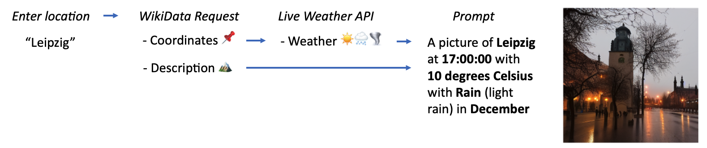

# Diffused Live Weather Cam (24/7) 📍
Using Keras' Stable Diffusion for generating city images using coordinates and a live weather API. (Keras Community Prize 2022)  



### a) Either use the [colab notebook]()

### b) Or run locally:

#### 1. Clone the repository and navigate to the notebook
```bash
git clone https://github.com/avocardio/diffusedweather.git
```
#### 2. Install the dependencies by executing the cells in the notebook 
```bash
!pip install tensorflow
!pip install keras-cv
!pip install pillow
!pip install numpy
!pip install matplotlib
!pip install sparqlwrapper
!pip install cdifflib
!pip install geopandas
!pip install Pillow
```
#### 3. Enter a german city in the last cell & run it: 
```bash
prompt, coords, name = create_prompt("Hamburg")

plot(prompt, coords, name)
```

# Credits
We would like to thank [Keras](https://keras.io/) for the [Stable Diffusion](https://keras.io/guides/keras_cv/generate_images_with_stable_diffusion/) implementation and for the [Keras Community Prize](https://discuss.tensorflow.org/t/announcing-the-keras-community-prize-first-edition/13148/15).

By Cornelius Wolff & Maximilian Kalcher
